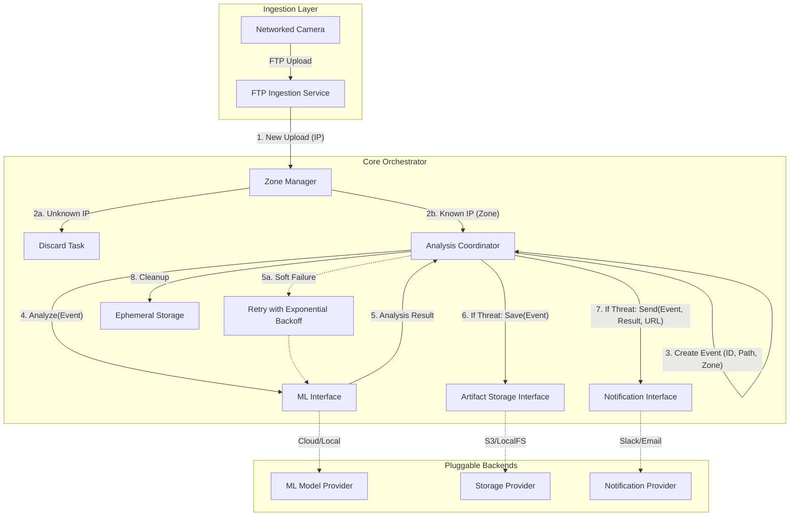

# Red Queen: Event-Driven Video Surveillance Threat Analysis System

Red Queen is a modular, event-driven video surveillance threat analysis system written in Go. It ingests video and image uploads via FTP from networked cameras, analyzes them using pluggable ML providers (such as Google Vertex AI), and triggers notifications across various channels (Webhook, Homey, Telegram, etc.) if a threat is detected.

## 🚀 Key Features

- **FTP Ingestion**: Built-in FTP server that identifies cameras by IP and maps them to human-readable **ZONES**.
- **Pluggable ML Analysis**:
  - **Vertex AI (Gemini)**: Leverages Google's multimodal Gemini models for advanced video understanding.
  - **Mock/Passthrough**: Providers for testing and debugging.
- **Pluggable Artifact Storage**:
  - **Local Storage**: Organizes threat artifacts by date and zone.
  - **S3/GCS Support**: (Extensible) for cloud-based storage.
- **Pluggable Notifications**:
  - **Telegram**: Rich alerts with media support.
  - **Webhooks**: Generic JSON POST integration.
  - **Homey**: Integration with Homey Cloud and Homey Pro (Local).
- **REST API**: Serves stored artifacts, system health, and Prometheus metrics.
- **Resilient Pipeline**: Automatic retries with exponential backoff for transient failures (Soft Failures).

## 🏗️ Architecture

Red Queen uses an internal orchestrator (the Coordinator) to manage the lifecycle of an upload from ingestion to notification.



## 🛠️ Getting Started

### Prerequisites

- **Go**: 1.24.0 or later.
- **Docker & Docker Compose**: For containerized deployment.
- **Make**: For running common tasks.

### Installation

1. Clone the repository:
   ```bash
   git clone https://github.com/youruser/red-queen.git
   cd red-queen
   ```

2. Build the binary:
   ```bash
   make build
   ```

3. Prepare configuration:
   ```bash
   cp config.example.yaml config.yaml
   # Edit config.yaml with your specific settings (FTP, ML, Zones, Notifications)
   ```

### Running the System

**Using Make:**
```bash
make run
```

**Using Docker Compose:**
```bash
docker-compose up -d
```

## ⚙️ Configuration

The system is configured via a `config.yaml` file. Key sections include:

- `ftp`: Listen address, port, and credentials for camera ingestion.
- `zones`: Mapping of IP addresses to human-readable zone names.
- `ml`: Choice of provider (e.g., `vertex-ai`) and model parameters.
- `storage`: Where to save flagged artifacts.
- `notifications`: List of enabled notification channels.

See `config.example.yaml` for a complete reference.

## 📂 Project Structure

- `cmd/red-queen/`: Main entry point and system initialization.
- `internal/`: Core business logic.
    - `coordinator/`: The orchestrator managing the event lifecycle.
    - `ftp/`: FTP server for camera ingestion.
    - `ml/`: ML analysis interfaces and implementations.
    - `notify/`: Notification providers (Telegram, Webhook, Homey).
    - `storage/`: Artifact storage providers.
    - `zone/`: IP-to-Zone resolution and management.
- `pkg/api/`: REST API for serving artifacts and metrics.
- `docs/`: Design documentation and feature guides.

## 🧪 Development & Testing

### Running Tests
```bash
make test               # Run unit tests
make integration-test   # Run end-to-end integration tests
```

### Adding a New Notifier
1. Implement the `Notifier` interface in `internal/notify/`.
2. Register the new notifier in the initialization loop within `cmd/red-queen/main.go`.
3. Add any necessary configuration fields to `internal/config/config.go`.

## 📄 License

This project is licensed under the MIT License - see the [LICENSE](LICENSE) file for details.
