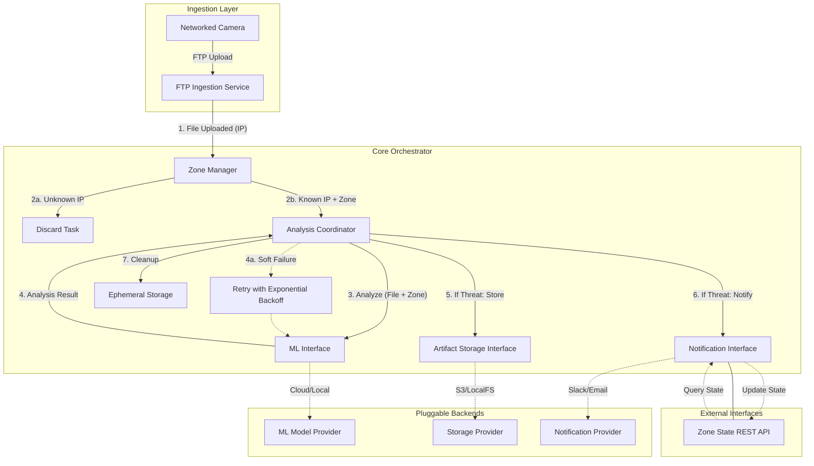
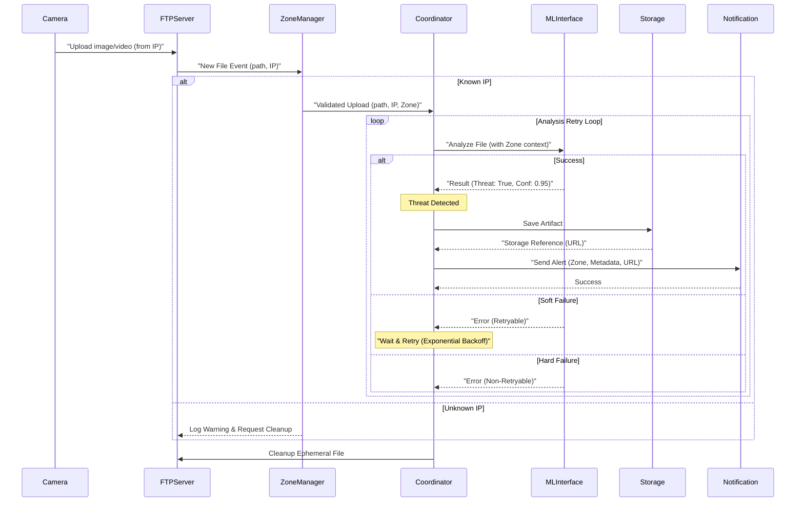

# Red Queen: System Design Documentation

## System Architecture

The Red Queen system is designed as a modular, event-driven application written in Go. It uses an internal orchestrator to coordinate between ingestion, analysis, storage, and notification components.

## System Components

### 1. Ingestion Service (FTP Server)
- **Responsibility**: Provides an FTP endpoint for cameras to upload images and video clips.
- **Mechanism**: Listen for file completion events. Upon successful upload, it hands over the file path and the camera's IP address to the Zone Manager.
- **Security**: Basic authentication with pre-configured credentials.

### 2. Zone Manager
- **Responsibility**: Identifies cameras and their associated **ZONES** by IP address.
- **Role**:
    - Maintains a registry of allowed camera IP addresses and their associated zone tags.
    - Acts as a gatekeeper, discarding uploads from unregistered IPs.
    - Enriches the upload metadata with the correct zone tag before handing it over to the Coordinator.

### 3. Analysis Coordinator (The "Orchestrator")
- **Responsibility**: Manages the lifecycle of every validated artifact.
- **Workflow**:
    - Receive validated file and zone metadata.
    - Invoke the ML Interface for threat detection (optionally providing zone-specific context).
    - **Resilience Strategy**:
        - If ML analysis returns a **Soft Failure** (e.g., network timeout, quota exceeded), the Coordinator re-queues the task for retry using an exponential backoff strategy (e.g., 2s, 4s, 8s...).
        - If ML analysis returns a **Hard Failure** (e.g., invalid file), the task is logged and cleanup is triggered immediately.
    - Evaluate results based on confidence thresholds.
    - Trigger Storage and Notification if a threat is confirmed.
    - Ensure ephemeral file cleanup.

### 4. ML Interface (Pluggable)
- **Responsibility**: Abstract the interaction with machine learning models.
- **Interface**:
    - `Analyze(filePath string, zone string) (Result, error)`
- **Error Handling**: The interface implementation is responsible for tagging errors as **Soft** or **Hard** failures to guide the Coordinator's retry logic.

### 5. Artifact Storage Interface (Pluggable)
- **Responsibility**: Abstract the permanent storage of flagged media.
- **Interface**:
    - `Save(artifact Artifact) (string, error)` (returns external URL or reference).

### 6. Notification Interface (Pluggable)
- **Responsibility**: Abstract the delivery of alerts to end-users and external APIs.
- **Interface**:
    - `Send(alert Alert) error`

---

## Data Flow Diagram

The following diagram traces the path of a single file, including the zone filtering and retry loop.

## Control Flow & Concurrency

- **Concurrent Processing**: Each new file event spawns a new goroutine to ensure high-throughput processing.
- **Backoff & Jitter**: Retries should include a random jitter factor to avoid "thundering herd" issues on the ML provider's API.
- **Context Handling**: Retries must respect a global timeout or cancellation context to prevent infinite loops during system shutdown.
