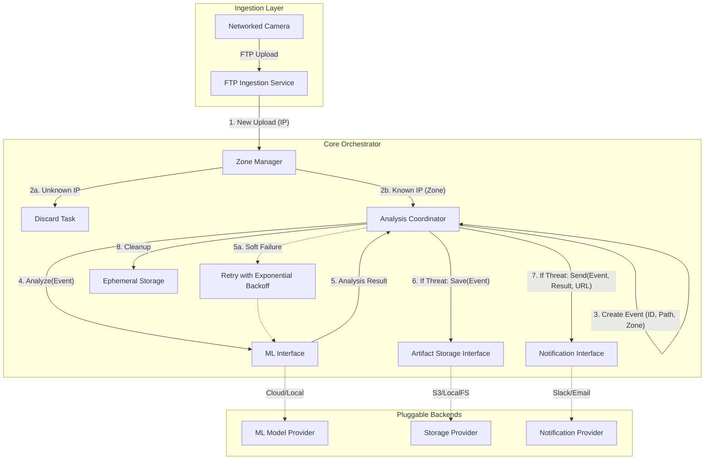
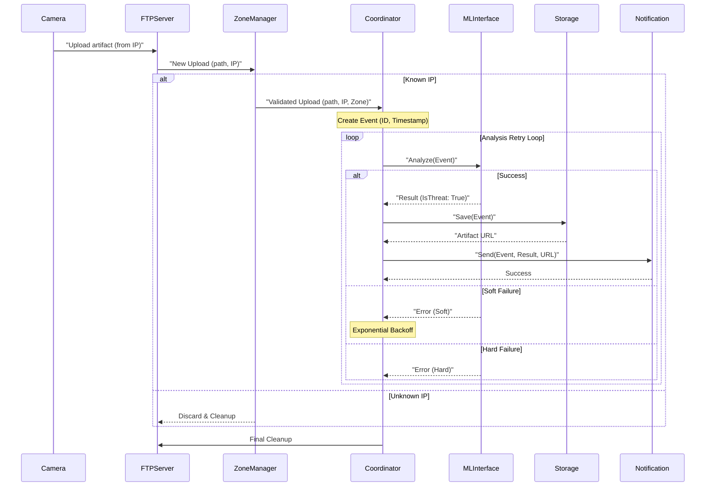

# Red Queen: System Design Documentation

## System Architecture

The Red Queen system is designed as a modular, event-driven application written in Go. It uses an internal orchestrator to coordinate between ingestion, analysis, storage, and notification components using a unified **Event** model.

## Core Data Model: The Event

To ensure consistency across all modules, the system uses a structured **Event** object:
- **ID**: A unique UUID for tracking the lifecycle of an upload.
- **FilePath**: The local path to the artifact (image/video).
- **Timestamp**: The precise time the upload was completed.
- **CameraIP**: The source IP address for identification.
- **Zone**: The human-readable zone tag resolved by the Zone Manager.

## System Components

### 1. Ingestion Service (FTP Server)
- **Responsibility**: Provides an FTP endpoint for cameras.
- **Mechanism**: Captures the source IP and file path. Upon completion, it notifies the Zone Manager.

### 2. Zone Manager
- **Responsibility**: Resolves IP addresses to **ZONES**.
- **Role**: Discards unauthorized traffic and enriches authorized uploads with zone context.

### 3. Analysis Coordinator (The "Orchestrator")
- **Responsibility**: Manages the lifecycle of the **Event**.
- **Workflow**:
    - Generates a unique Event ID.
    - Orchestrates ML analysis with retry logic.
    - Coordinates storage and notifications if a threat is confirmed.
    - Ensures the local file is deleted after processing.

### 4. ML Interface (Pluggable)
- **Interface**: `Analyze(ctx, Event) (Result, error)`
- **Error Handling**: Distinguishes between **Soft** (retryable) and **Hard** (fatal) failures.

### 5. Artifact Storage Interface (Pluggable)
- **Interface**: `Save(ctx, Event) (URL, error)`
- **Responsibility**: Persists the artifact and returns a referenceable URL.
- **Implementations**:
    - **Local Storage**: Moves flagged artifacts to a permanent root directory structured by date and zone (`root_path/YYYY-MM-DD/zone/eventID_filename`).

### 6. Notification Interface (Pluggable)
- **Interface**: `Send(ctx, Event, Result, URL) error`
- **Responsibility**: Delivers contextual alerts to external channels.
- **Implementations**:
    - **Webhook Notifier**: Sends a JSON POST request with event details and a link to the stored artifact.

### 7. REST API Server
- **Responsibility**: Serves stored artifacts and provides health monitoring.
- **Endpoints**:
    - `/artifacts/{date}/{zone}/{filename}`: Serves recorded threat artifacts from local storage.
    - `/health`: Simple health check endpoint.

---

## Data Flow Diagram

