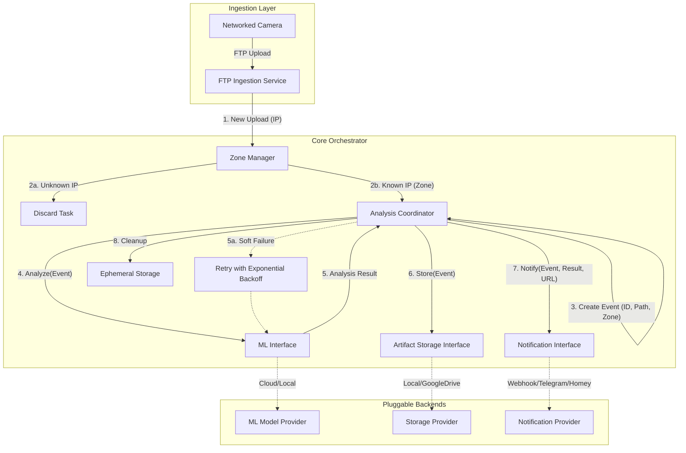
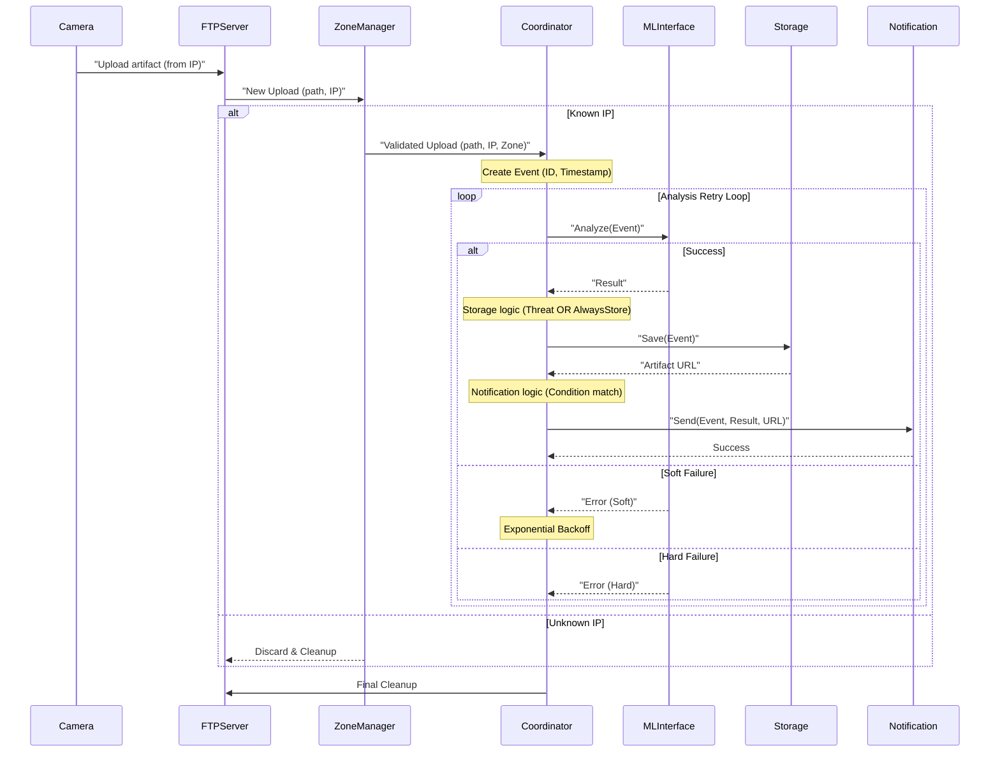

# Red Queen: System Design Documentation

## System Architecture

The Red Queen system is designed as a modular, event-driven application written in Go. It uses an internal orchestrator to coordinate between ingestion, analysis, storage, and notification components using a unified **Event** model.



## Core Data Model: The Event

To ensure consistency across all modules, the system uses a structured **Event** object:
- **ID**: A unique UUID for tracking the lifecycle of an upload.
- **FilePath**: The local path to the artifact (image/video).
- **Timestamp**: The precise time the upload was completed.
- **CameraIP**: The source IP address for identification.
- **Zone**: The human-readable zone tag resolved by the Zone Manager.
- **Labels**: Tags associated with the event (populated from ML analysis results).
- **Description**: Free-text description of the event (populated from ML analysis results).

## System Components

### 1. Ingestion Service (FTP Server)
- **Responsibility**: Provides an FTP endpoint for cameras.
- **Mechanism**: Captures the source IP and file path. Upon completion, it notifies the Zone Manager.

### 2. Zone Manager
- **Responsibility**: Resolves IP addresses to **ZONES**.
- **Role**: Discards unauthorized traffic and enriches authorized uploads with zone context.

### 3. Analysis Coordinator (The "Orchestrator")
- **Responsibility**: Manages the lifecycle of the **Event**.
- **Workflow**:
    - Generates a unique Event ID.
    - Orchestrates ML analysis with retry logic.
    - Coordinates storage and notifications based on configuration:
        - **Storage**: Always if `always_store` is enabled, otherwise only on confirmed threats.
        - **Notifications**: Based on each notifier's `condition` (`on_threat` or `always`).
    - Ensures the local file is deleted after processing.

### 4. ML Interface (Pluggable)
- **Interface**: `Analyze(ctx, Event) (Result, error)`
- **Error Handling**: Distinguishes between **Soft** (retryable) and **Hard** (fatal) failures.
- **Implementations**:
    - **Gemini AI (Gemini)**: Uses Google's multimodal Gemini models for advanced video understanding. It is configured via `project_id`, `location`, and `model_name`. It uses structured JSON output for reliable parsing. See [Gemini AI Setup Guide](GEMINI_AI.md) for authentication and setup instructions.
    - **Always (Debug)**: A passthrough analyzer that always returns a threat. Useful for testing storage and notification logic without external dependencies.

### 5. Artifact Storage Interface (Pluggable)
- **Interface**: `Save(ctx, Event) (URL, error)`
- **Responsibility**: Persists the artifact and returns a referenceable URL.
- **Multi-provider**: Multiple backends can be configured simultaneously. A `MultiProvider` wrapper fans out `Save` calls concurrently — failure of one backend does not prevent others from saving. The URL from the first successful provider is returned.
- **Implementations**:
    - **Local Storage**: Copies flagged artifacts to a permanent root directory structured by date and zone (`root_path/YYYY-MM-DD/zone/eventID_filename`). Required for artifact serving via the REST API.
    - **Google Drive**: Uploads artifacts to a configured Drive folder using a service account. Files are private (inherit folder sharing settings). Returns a `webViewLink`. See [Multi-Provider Storage Design](MULTI_STORAGE.md) for setup details.

### 6. Notification Interface (Pluggable)
- **Interface**: `Send(ctx, Event, Result, URL) error`
- **Responsibility**: Delivers contextual alerts to external channels.
- **Implementations**:
    - **Webhook Notifier**: Sends a JSON POST request with event details and a link to the stored artifact.
    - **Homey Notifier**: Supports both Homey Cloud and Homey Pro (Local). It triggers flows with a custom tag containing the alert message and artifact URL.
    - **Telegram Notifier**: Sends a rich MarkdownV2-formatted alert to a Telegram chat. Attempts to upload the artifact file directly (image or video) and falls back to a text message with an artifact URL. See [Telegram Notifier Design](TELEGRAM_NOTIFIER.md) for details.

### 7. REST API Server
- **Responsibility**: Serves stored artifacts and provides health/telemetry monitoring.
- **Endpoints**:
    - `/artifacts/{date}/{zone}/{filename}`: Serves recorded threat artifacts from local storage.
    - `/health`: Simple health check endpoint.
    - `/metrics`: Prometheus metrics for system monitoring.

---

## Deployment

### Docker
The system can be deployed using Docker for consistent environments across local and cloud servers.

1. **Build the image**:
   ```bash
   docker build -t red-queen .
   ```

2. **Run with Docker Compose**:
   ```bash
   docker-compose up -d
   ```

3. **Volumes**:
   - `/config`: Mount your `config.yaml` here.
   - `/data/uploads`: Temporary directory for FTP uploads.
   - `/data/storage`: Permanent archive for threat artifacts.

---

## Data Flow Diagram


