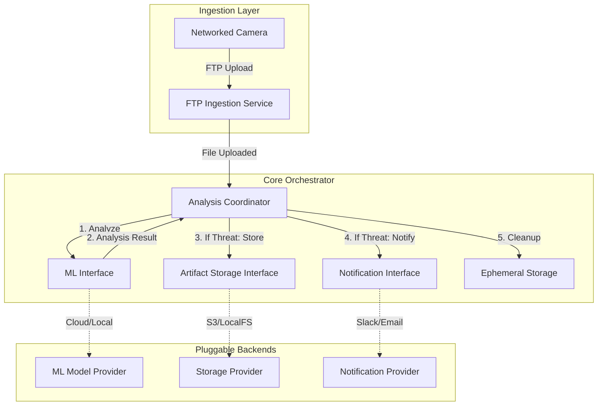
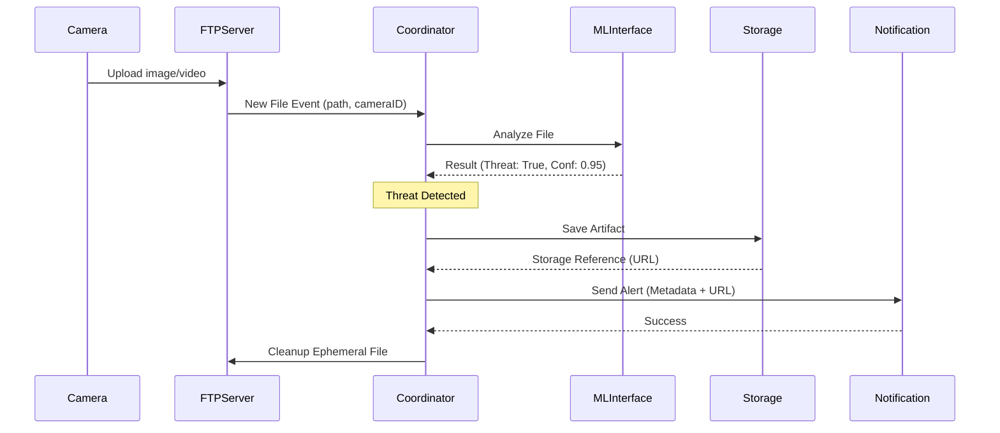

# Red Queen: System Design Documentation

## System Architecture

The Red Queen system is designed as a modular, event-driven application written in Go. It uses an internal orchestrator to coordinate between ingestion, analysis, storage, and notification components.

## System Components

### 1. Ingestion Service (FTP Server)
- **Responsibility**: Provides an FTP endpoint for cameras to upload images and video clips.
- **Mechanism**: Listen for file completion events. Upon successful upload, it hands over the file path and metadata (e.g., Camera ID) to the Coordinator.
- **Security**: Basic authentication with pre-configured credentials.

### 2. Analysis Coordinator (The "Orchestrator")
- **Responsibility**: Manages the lifecycle of every uploaded artifact.
- **Workflow**:
    - Receive file from Ingestion Service.
    - Invoke the ML Interface for threat detection.
    - Evaluate results based on confidence thresholds.
    - Trigger Storage and Notification if a threat is confirmed.
    - Ensure ephemeral file cleanup.

### 3. ML Interface (Pluggable)
- **Responsibility**: Abstract the interaction with machine learning models.
- **Interface**:
    - `Analyze(filePath string) (Result, error)`
- **Result**: Contains labels, confidence scores, and threat classification.

### 4. Artifact Storage Interface (Pluggable)
- **Responsibility**: Abstract the permanent storage of flagged media.
- **Interface**:
    - `Save(artifact Artifact) (string, error)` (returns external URL or reference).
- **Implementations**: Local File System, AWS S3, Google Cloud Storage.

### 5. Notification Interface (Pluggable)
- **Responsibility**: Abstract the delivery of alerts to end-users.
- **Interface**:
    - `Send(alert Alert) error`
- **Implementations**: Webhooks, Slack, Email, SMS.

---

## Data Flow Diagram

The following diagram traces the path of a single file from ingestion to final action.

## Control Flow & Concurrency

- **Concurrent Processing**: Each new file event from the FTP server spawns a new goroutine (or is picked up by a worker pool) to ensure that multiple cameras uploading simultaneously do not block each other.
- **Error Handling**: If the ML analysis fails, the system logs the error and ensures the ephemeral file is still cleaned up to prevent disk exhaustion.
- **Graceful Shutdown**: The system should allow active analysis tasks to complete before shutting down the FTP server and storage connections.
