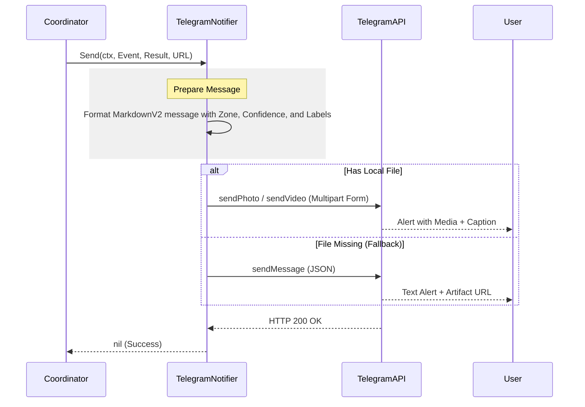

# Telegram Bot Notifier Design

## Overview
The Telegram Bot Notifier provides a rich notification channel for the Red Queen system. It allows the system to send real-time alerts to a Telegram chat (individual or group), including metadata and the captured artifact (image/video).

## Integration Architecture
The Telegram Notifier implements the `notify.Notifier` interface. It is instantiated by the `Coordinator` during startup if configured in `config.yaml`.

### Sequence Diagram


## Configuration
The following fields in the `NotifyConfig` struct in `internal/config/config.go` apply to the Telegram notifier:

| Field | Type | Description |
|-------|------|-------------|
| `type` | string | Must be `telegram`. |
| `enabled` | bool | Enables the notifier. |
| `condition` | string | (Optional) Notification condition: `on_threat` (default) or `always`. |
| `token` | string | The Telegram Bot API token from [@BotFather](https://t.me/botfather). |
| `chat_id` | int64 | The unique identifier for the target chat or group. |
| `artifact_base_url` | string | (Optional) The public base URL of the Red Queen API for artifact links. |

### Example Configuration
```yaml
notifications:
  - type: telegram
    enabled: true
    condition: "on_threat"
    token: "123456789:ABCdefGHIjklMNOpqrsTUVwxyZ"
    chat_id: -100123456789
    artifact_base_url: "https://my-red-queen.example.com"
```

## Implementation Details

### 1. Message Formatting
The notifier uses `MarkdownV2` for rich text formatting.
- **Header**: 🚨 *Threat Detected\!* (if threat) or ✅ *Event Recorded* (otherwise).
- **Zone**: `event.Zone`
- **Confidence**: `result.Confidence` (formatted as percentage)
- **Labels**: `result.Labels` (comma separated)
- **Time**: `event.Timestamp` (formatted as `YYYY-MM-DD HH:MM:SS`)
- **Link**: A clickable link to the artifact if `artifact_base_url` is configured.

### 2. Media Delivery
Unlike the Webhook or Homey notifiers which only send a URL, the Telegram notifier attempts to upload the actual file:
- It reads the file from `event.FilePath` (which is guaranteed to exist until the Coordinator's `defer` block executes).
- It uses `sendPhoto` for images (`.jpg`, `.jpeg`, `.png`, `.gif`) and `sendVideo` for video files (`.mp4`, `.mov`, `.avi`).
- The formatted message is sent as the `caption` of the media.

### 3. Error Handling
- **Rate Limiting**: The notifier logs 429 errors from Telegram but does not block the system.
- **File Access**: If the local file cannot be read, it falls back to a plain `sendMessage` call with the artifact URL (if available).
- **Network**: Standard Go `http.Client` timeouts apply (configured via `http_client.timeout` in `config.yaml`, default 30s).

## Security Considerations
- **Token Protection**: The Telegram Bot token allows full control over the bot. It must be kept secret and never checked into source control.
- **Chat ID**: Ensure the bot is added to the group/chat before it can send messages.
