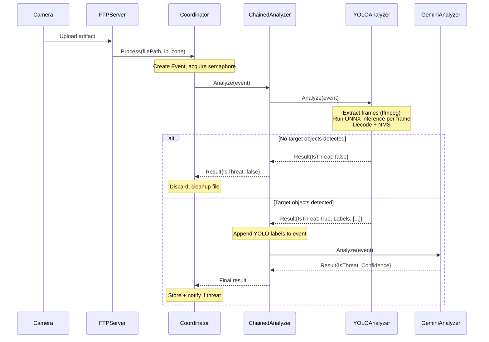

# Detection Pipeline: Design Document

## Motivation

The current pipeline sends every uploaded artifact directly to Gemini AI for analysis. Gemini is powerful but has non-trivial latency and per-request cost. The majority of uploads from a security camera are benign: empty rooms, slow-moving shadows, vegetation in wind.

A YOLO-based prefilter adds a fast, local object-detection stage before Gemini. If YOLO finds no objects of interest, the artifact is discarded without ever touching the cloud API. This reduces cost, increases throughput, and lowers median latency for the common (non-threat) case.

---

## Architecture Overview

The pipeline is restructured as a general two-stage chain. Both stages implement the same `ml.Analyzer` interface, so any analyzer can act as a prefilter for any other. The most common configuration pairs a local YOLO ONNX model (fast, cheap) with Gemini AI (thorough, cloud).

```
Upload → ZoneManager → Coordinator
                           │
                    ChainedAnalyzer
                     ┌─────┴──────┐
                     │            │
               [Prefilter]   [Analysis]
                YOLO ONNX    Gemini AI
                (in-process) (cloud)
                     │
                  no match → IsThreat: false  (Gemini never called)
                  match    → run Analysis stage → final verdict
```

`ChainedAnalyzer` itself implements `ml.Analyzer` and is wired as the single analyzer passed to the `Coordinator`. No coordinator, FTP, or zone changes are required. The prefilter stage is **optional**: if omitted from config, the `Coordinator` receives the analysis stage analyzer directly.

---

## Configuration Structure

The top-level `ml` key is replaced by `detection`, which contains two parallel subsections — `prefilter` (optional) and `analysis` — each with the same shape. This makes the interface-level symmetry visible in config.

```yaml
detection:
  prefilter:
    provider: "yolo-onnx"
    model_path: "/models/yolov8n.onnx"
    execution_provider: "cpu"       # "cpu" | "cuda" | "tensorrt" | "coreml"
    threshold: 0.50                 # minimum detection confidence
    target_objects: ["person", "vehicle", "animal"]
    frame_interval: "0.25s"            # for video: sample one frame every N seconds

  analysis:
    provider: "gemini-ai"
    model_name: "gemini-1.5-flash"
    project_id: "my-gcp-project"
    location: "us-central1"
    threshold: 0.80
    target_objects: ["person with weapon", "intruder"]
    max_artifact_size: 20971520     # 20 MB
```

Without-prefilter configuration (current behaviour preserved):

```yaml
detection:
  analysis:
    provider: "gemini-ai"
    model_name: "gemini-1.5-flash"
    project_id: "my-gcp-project"
    location: "us-central1"
    threshold: 0.80
    target_objects: ["person with weapon", "intruder"]
```

### Go structs (`internal/config/config.go`)

`MLConfig` is replaced by:

```go
// DetectionConfig configures the multi-stage detection pipeline.
// Prefilter is optional; when nil the Analysis stage runs directly.
type DetectionConfig struct {
    Prefilter *AnalyzerConfig `mapstructure:"prefilter"`
    Analysis  AnalyzerConfig  `mapstructure:"analysis"`
}

// AnalyzerConfig holds all fields for any analyzer implementation.
// Fields that do not apply to a given provider are ignored.
type AnalyzerConfig struct {
    Provider string `mapstructure:"provider"` // "yolo-onnx" | "gemini-ai" | "always"

    // Common fields
    Threshold     float64        `mapstructure:"threshold"`
    TargetObjects []string       `mapstructure:"target_objects"`

    // YOLO ONNX (provider: "yolo-onnx")
    ModelPath         string        `mapstructure:"model_path"`
    ExecutionProvider string        `mapstructure:"execution_provider"` // default: "cpu"
    FrameInterval     time.Duration `mapstructure:"frame_interval"`     // default: 2s

    // Gemini AI (provider: "gemini-ai")
    ModelName       string `mapstructure:"model_name"`
    ProjectID       string `mapstructure:"project_id"`
    Location        string `mapstructure:"location"`
    Endpoint        string `mapstructure:"endpoint"`
    APIKey          string `mapstructure:"api_key"`
    MaxArtifactSize int64  `mapstructure:"max_artifact_size"`
}
```

`Config.ML` is replaced by `Config.Detection DetectionConfig`.

---

## Component Design

### Factory function (`internal/ml/factory.go`)

A single constructor dispatches on `provider`, so the wiring in `app.go` never needs to know which concrete type it is building:

```go
// NewAnalyzer constructs an Analyzer from the given config.
func NewAnalyzer(ctx context.Context, cfg config.AnalyzerConfig, logger *zap.Logger) (Analyzer, error) {
    switch cfg.Provider {
    case "yolo-onnx":
        return NewYOLOAnalyzer(cfg, logger)
    case "gemini-ai":
        return NewGeminiAnalyzer(ctx, cfg, logger)
    case "always":
        return &PassThroughAnalyzer{}, nil
    default:
        return &MockAnalyzer{}, nil
    }
}
```

### App wiring (`internal/app/app.go`)

```go
analysis, err := ml.NewAnalyzer(ctx, cfg.Detection.Analysis, logger)
if err != nil {
    return nil, fmt.Errorf("analysis stage: %w", err)
}

var analyzer ml.Analyzer = analysis
if cfg.Detection.Prefilter != nil {
    prefilter, err := ml.NewAnalyzer(ctx, *cfg.Detection.Prefilter, logger)
    if err != nil {
        return nil, fmt.Errorf("prefilter stage: %w", err)
    }
    analyzer = ml.NewChainedAnalyzer(prefilter, analysis, logger)
}
```

### `ChainedAnalyzer` (`internal/ml/chain.go`)

```go
type ChainedAnalyzer struct {
    prefilter Analyzer
    analysis  Analyzer
    logger    *zap.Logger
}
```

**`Analyze` behaviour:**
1. Record start time; run `prefilter.Analyze(ctx, event)`.
2. Emit `prefilter_duration_seconds` and `prefilter_outcome` metrics.
3. If error → return it (coordinator's retry logic applies to both error types).
4. If `result.IsThreat == false` → return the result; the chain short-circuits.
5. Append prefilter labels to `event.Labels` so the analysis stage has context.
6. Run `analysis.Analyze(ctx, event)`.
7. If analysis returns an `ErrorHard` **and** a prefilter stage was used → log a warning and return the prefilter result (`IsThreat: true`) rather than the error. The prefilter already identified objects of interest; discarding that signal silently would be fail-open from a security perspective. If no prefilter was used, propagate the error normally.
8. For `ErrorSoft` from analysis → return the error so the coordinator's retry loop applies.

**`Name()`:** returns `"<prefilter.Name()>+<analysis.Name()>"` (e.g. `"yolo-onnx+gemini-ai"`), used as the `analyzer` Prometheus label.

### `YOLOAnalyzer` (`internal/ml/yolo.go`)

Runs a YOLOv8 ONNX model in-process via [onnxruntime_go](https://github.com/yalue/onnxruntime_go). No network call, no second process.

```go
type YOLOAnalyzer struct {
    session       *ort.AdvancedSession
    threshold     float64
    targets       map[string]struct{}
    frameInterval time.Duration
    classNames    []string    // loaded from model metadata
    logger        *zap.Logger
}
```

**Startup:** `NewYOLOAnalyzer` loads the ONNX model once and keeps the session open for the lifetime of the process. The execution provider (CPU, CUDA, TensorRT, CoreML) is selected via `SessionOptions` before the session is created.

**`Analyze` behaviour (per event):**
1. Extract frames from the artifact using `ffmpeg` subprocess at `frame_interval`.
   For image files, the file itself is the single frame.
2. For each frame: pre-process → run inference → post-process.
3. Short-circuit on the first frame that yields a matching detection — no need to process the full clip once a positive signal is found.
4. Return `Result{IsThreat: true, Labels: <matched class names>}` on match, `Result{IsThreat: false}` otherwise.

**`Name()`:** returns `"yolo-onnx"`.

#### Frame extraction

`ffmpeg` is invoked as a subprocess to sample frames from video files:

```
ffmpeg -i <path> -vf fps=1/<interval_secs> -f image2pipe -vcodec rawvideo -pix_fmt rgb24 pipe:1
```

Raw RGB24 frames are streamed over stdout and read in a loop, avoiding temporary files on disk. For image inputs (`event.FilePath` has an image MIME type), the file is decoded directly.

#### YOLO inference pipeline

```
Frame (RGB24 bytes)
  → resize to 640×640 (bilinear)
  → normalize pixels to [0.0, 1.0]
  → reshape to NCHW float32 tensor [1, 3, 640, 640]
  → ort.Session.Run()
  → output tensor [1, 84, 8400]   (4 box coords + 80 class scores per anchor)
  → transpose to [8400, 84]
  → filter rows where max class score ≥ threshold
  → convert cx/cy/w/h to x1/y1/x2/y2
  → Non-Maximum Suppression (IoU threshold 0.45)
  → map class index → class name
  → match against target_objects
```

All tensor math (resize, normalize, NMS) is pure Go — no additional CGo beyond the ONNX Runtime binding itself.

#### Execution providers

The `execution_provider` config value maps to ONNX Runtime session options:

| Config value | ONNX EP | Notes |
|---|---|---|
| `cpu` (default) | CPU | Always available; no extra library |
| `cuda` | CUDA | Requires GPU-build of `libonnxruntime` |
| `tensorrt` | TensorRT | Higher throughput; NVIDIA only |
| `coreml` | CoreML | Apple Silicon / macOS |

The Go binary itself is identical across all providers. Only the `libonnxruntime` shared library variant changes.

---

## Data Flow



---

## Metrics

The existing coordinator-level metric `ml_analysis_duration_seconds{analyzer="yolo-onnx+gemini-ai"}` captures total chain latency. Two additional metrics in `internal/metrics/metrics.go` give per-stage visibility:

```go
// PrefilterDuration tracks per-stage prefilter latency.
PrefilterDuration = promauto.NewHistogramVec(prometheus.HistogramOpts{
    Name:    "detection_prefilter_duration_seconds",
    Help:    "Prefilter stage latency.",
    Buckets: prometheus.DefBuckets,
}, []string{"zone", "analyzer"})

// PrefilterOutcome counts prefilter pass/filter decisions.
PrefilterOutcome = promauto.NewCounterVec(prometheus.CounterOpts{
    Name: "detection_prefilter_outcome_total",
    Help: "Prefilter stage outcomes.",
}, []string{"zone", "analyzer", "outcome"}) // outcome: "pass" | "filtered" | "analysis-fallback"
```

These are emitted by `ChainedAnalyzer` after the prefilter stage completes, regardless of the concrete analyzer type used as a prefilter.

---

## Error Handling

| Scenario | Behaviour |
|---|---|
| YOLO ONNX model fails to load at startup | Fatal error; process exits before accepting connections |
| `ffmpeg` not found / frame extraction fails | `ErrorHard` → coordinator stops, file cleaned up |
| ONNX inference panics / OOM | `ErrorHard` (recovered and wrapped) |
| Analysis stage (Gemini) soft-fails | `ErrorSoft` → coordinator retries with backoff |
| Analysis stage (Gemini) hard-fails, prefilter was used | Return prefilter result (`IsThreat: true`) with a warning log; emit `outcome="analysis-fallback"` metric. Fail-secure: the prefilter already detected objects of interest. |
| Analysis stage (Gemini) hard-fails, no prefilter | `ErrorHard` propagated → coordinator stops, file cleaned up |
| Context deadline exceeded | Propagated via `ctx`; `ffmpeg` subprocess is killed on cancellation |

Because the YOLO model runs in-process, there is no network dependency for the prefilter stage. Infrastructure failures cannot cause prefilter soft-errors.

The asymmetry in hard-fail handling is intentional: without a prefilter there is no prior signal to fall back on, so propagating the error is correct. With a prefilter, suppressing a confirmed object detection to protect against a cloud API failure would be a security regression.

---

## Testing

- **`YOLOAnalyzer` unit tests** (`internal/ml/yolo_test.go`): load a minimal ONNX model (or mock the session interface) to test pre/post-processing logic, frame extraction, and error paths without requiring a full model file.
- **`ChainedAnalyzer` unit tests** (`internal/ml/chain_test.go`): use `MockAnalyzer` for both stages to verify short-circuit logic, label merging, metric emission, and error propagation.
- **Factory unit tests** (`internal/ml/factory_test.go`): verify provider dispatch returns the correct concrete types.
- **Integration tests** (`tests/integration_test.go`): configure the binary with `provider: "always"` as the prefilter (always passes) and the existing mock as the analysis stage to exercise the full pipeline end-to-end without a real model.

---

## Deployment

No sidecar is required. The `red-queen` binary links `libonnxruntime` and loads the ONNX model at startup from the path specified in `model_path`.

`ffmpeg` must be available on `$PATH` for video frame extraction.

```yaml
services:
  red-queen:
    build: .
    environment:
      RED_QUEEN_CONFIG: /config/config.yaml
    volumes:
      - ./config.yaml:/config/config.yaml
      - ./models:/models              # ONNX model files
      - uploads:/data/uploads
      - storage:/data/storage
```

For GPU inference, swap the `libonnxruntime` build in the Dockerfile and set `execution_provider: "cuda"` in config. The Go binary and the rest of the deployment are unchanged.

---

## Review Notes & Implementation Guidelines

Following a design review, the following observations and guidelines should be considered during implementation:

### 1. External Dependencies
- **ffmpeg**: The `Dockerfile` must be updated to include `ffmpeg`. The `frame_interval` is set to `0.25s` (4 fps). CPU cost is bounded in practice by the short-circuit: inference stops on the first frame that yields a matching detection, so a finer interval does not imply processing the full clip.
- **onnxruntime**: The build process (`Makefile` and `Dockerfile`) needs specific logic to fetch the correct `libonnxruntime` shared library for the target architecture (`amd64`/`arm64`) and execution provider.

### 2. Operational Considerations
- **Memory Footprint**: Even "nano" YOLO models require significant RAM (often 200MB+ for the session). The documentation should include guidance on hardware sizing, particularly for low-power edge devices.
- **Configuration Migration**: The transition from `ml` to `detection` in `config.yaml` is a breaking change. `config.example.yaml` must be updated, and the migration should be clearly documented for existing users.

### 3. Intelligence Refinement
- **Contextual Prompting**: When YOLO labels are merged into the event, the Gemini analysis stage can be optimized. Consider refining the Gemini prompt to use these labels as "hints" (e.g., *"YOLO detected a 'person'. Confirm if they are carrying a weapon."*), potentially improving Gemini's accuracy and reducing its "hallucination" rate.
- **Fail-Secure Architecture**: The `ChainedAnalyzer` logic that falls back to the prefilter result on a Gemini `ErrorHard` is a critical security invariant. This behavior must be explicitly verified with unit tests.

---

## Open Questions / Future Work

1. **Per-zone prefilter config**: Different zones may warrant different target objects or thresholds (outdoor zones watch for vehicles; indoor zones watch only for people). This would require `prefilter` to be part of `ZoneConfig` or support a zone-level override map.
2. **Model variants**: `yolov8n` (nano) is fastest but least accurate. Operators on more capable hardware may prefer `yolov8s` or `yolov8m`. The `model_path` config already supports this; the ONNX export step needs to be documented.
3. **Three-stage pipelines**: The `ChainedAnalyzer` as designed chains exactly two stages. A slice-based `PipelineAnalyzer` would support arbitrary depth (e.g., YOLO → cheap cloud classifier → Gemini), at the cost of slightly more complex wiring. Defer until there is a concrete use case.
4. **Frame extraction without ffmpeg**: Shipping a statically-linked ffmpeg binary in the Docker image avoids the runtime dependency. Alternatively, a pure-Go video decoder (e.g., for H.264 via WebRTC libraries) would remove the subprocess entirely at the cost of implementation complexity.
5. **Model hot-reload**: Restarting the process to swap a model is acceptable for a home deployment but undesirable in production. A SIGHUP handler that re-initialises the ONNX session would address this.
